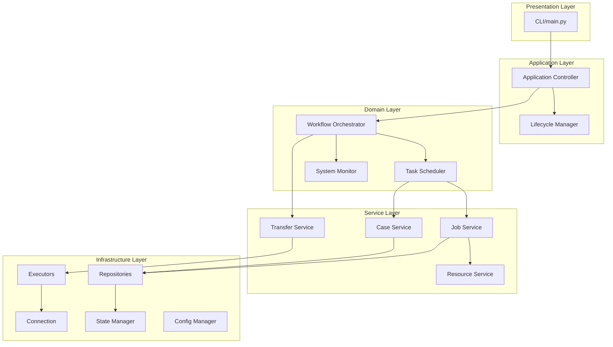

# MQI Communicator Specification (개선판)

## 1. Introduction

MQI Communicator는 의료물리 품질보증(QA) 작업을 자동화하는 Python 기반 시스템입니다. "MOQUI"라는 코드명을 가진 이 시스템은 새로운 환자 데이터(case) 스캔, 원격 HPC 환경으로의 전송, GPU 계산 실행, 결과 회수의 워크플로우를 자동화합니다.

## 2. 설계 원칙

- **단일 책임 원칙(SRP)**: 각 모듈은 하나의 명확한 책임만 가짐
- **의존성 역전 원칙(DIP)**: 추상화에 의존, 구체 클래스가 아닌 인터페이스 의존
- **개방-폐쇄 원칙(OCP)**: 확장에는 열려있고 수정에는 닫혀있음
- **테스트 가능성**: 모든 비즈니스 로직은 단위 테스트 가능
- **명확한 계층 구조**: 상위 계층은 하위 계층만 참조

## 3. 계층 구조



## 4. 모듈 상세 명세

### 4.1 Presentation Layer

#### `main.py`
- **책임**: CLI 진입점
- **의존성**: `Application`
- **인터페이스**: 없음

### 4.2 Application Layer

#### `controllers/application.py`
- **책임**: 애플리케이션 초기화 및 종료
- **의존성**: `LifecycleManager`, `WorkflowOrchestrator`, 의존성 주입 컨테이너
- **인터페이스**: `IApplication`
```python
class IApplication(Protocol):
    def initialize(self) -> None: ...
    def run(self) -> None: ...
    def shutdown(self) -> None: ...
```

#### `controllers/lifecycle_manager.py`
- **책임**: 프로세스 생명주기 관리 (PID lock, graceful shutdown)
- **의존성**: 파일시스템
- **인터페이스**: `ILifecycleManager`
```python
class ILifecycleManager(Protocol):
    def acquire_lock(self) -> bool: ...
    def release_lock(self) -> None: ...
    def register_shutdown_handler(self, handler: Callable) -> None: ...
```

### 4.3 Domain Layer

#### `domain/workflow_orchestrator.py`
- **책임**: 전체 워크플로우 조정
- **의존성**: `ITaskScheduler`, `ISystemMonitor`, `ITransferService`
- **인터페이스**: `IWorkflowOrchestrator`
```python
class IWorkflowOrchestrator(Protocol):
    def start(self) -> None: ...
    def stop(self) -> None: ...
    def process_case(self, case_id: str) -> None: ...
```

#### `domain/task_scheduler.py`
- **책임**: 작업 스케줄링 및 큐 관리
- **의존성**: `ICaseService`, `IJobService`
- **인터페이스**: `ITaskScheduler`
```python
class ITaskScheduler(Protocol):
    def schedule_case(self, case_id: str) -> None: ...
    def get_next_task(self) -> Optional[Task]: ...
    def complete_task(self, task_id: str) -> None: ...
```

#### `domain/system_monitor.py`
- **책임**: 시스템 리소스 모니터링
- **의존성**: 시스템 API
- **인터페이스**: `ISystemMonitor`
```python
class ISystemMonitor(Protocol):
    def get_cpu_usage(self) -> float: ...
    def get_gpu_status(self) -> List[GPUStatus]: ...
    def get_disk_usage(self) -> DiskUsage: ...
```

### 4.4 Service Layer

#### `services/case_service.py`
- **책임**: Case 비즈니스 로직
- **의존성**: `ICaseRepository`, `IFileSystem`
- **인터페이스**: `ICaseService`
```python
class ICaseService(Protocol):
    def scan_for_new_cases(self) -> List[str]: ...
    def get_case(self, case_id: str) -> Case: ...
    def update_case_status(self, case_id: str, status: str) -> None: ...
```

#### `services/job_service.py`
- **책임**: Job 비즈니스 로직
- **의존성**: `IJobRepository`, `IResourceService`
- **인터페이스**: `IJobService`
```python
class IJobService(Protocol):
    def create_job(self, case_id: str) -> Job: ...
    def allocate_resources(self, job: Job) -> bool: ...
    def complete_job(self, job_id: str) -> None: ...
```

#### `services/resource_service.py`
- **책임**: 리소스(GPU, 디스크) 관리
- **의존성**: `IResourceRepository`
- **인터페이스**: `IResourceService`
```python
class IResourceService(Protocol):
    def allocate_gpus(self, count: int) -> List[int]: ...
    def release_gpus(self, gpu_ids: List[int]) -> None: ...
    def check_disk_space(self) -> bool: ...
```

#### `services/transfer_service.py`
- **책임**: 파일 전송 오케스트레이션
- **의존성**: `ITransferExecutor`
- **인터페이스**: `ITransferService`
```python
class ITransferService(Protocol):
    def upload_case(self, case_id: str) -> None: ...
    def download_results(self, case_id: str) -> None: ...
```

### 4.5 Infrastructure Layer

#### `infrastructure/repositories/`
- **책임**: 데이터 영속성
- **구현체**: 
  - `CaseRepository`: Case 데이터 관리
  - `JobRepository`: Job 데이터 관리
  - `ResourceRepository`: 리소스 상태 관리

#### `infrastructure/executors/`
- **책임**: 명령 실행 추상화
- **구현체**:
  - `LocalExecutor`: 로컬 명령 실행
  - `RemoteExecutor`: SSH를 통한 원격 명령 실행
  - `TransferExecutor`: SFTP 파일 전송

#### `infrastructure/connection/`
- **책임**: 네트워크 연결 관리
- **구현체**:
  - `SSHConnectionPool`: SSH 연결 풀 관리
  - `RetryPolicy`: 재시도 정책

#### `infrastructure/state/`
- **책임**: 상태 영속성
- **구현체**:
  - `JsonStateManager`: JSON 파일 기반 상태 관리
  - `StateTransaction`: 트랜잭션 지원

#### `infrastructure/config/`
- **책임**: 설정 관리
- **구현체**:
  - `ConfigLoader`: 설정 파일 로드
  - `ConfigValidator`: 설정 검증

## 5. 데이터 모델

### 5.1 Domain Models

```python
@dataclass
class Case:
    case_id: str
    status: CaseStatus
    beam_count: int
    created_at: datetime
    updated_at: datetime
    metadata: Dict[str, Any]

@dataclass
class Job:
    job_id: str
    case_id: str
    status: JobStatus
    gpu_allocation: List[int]
    priority: int
    created_at: datetime
    started_at: Optional[datetime]
    completed_at: Optional[datetime]

@dataclass
class Task:
    task_id: str
    job_id: str
    type: TaskType
    parameters: Dict[str, Any]
    status: TaskStatus
```

### 5.2 Value Objects

```python
class CaseStatus(Enum):
    NEW = "new"
    QUEUED = "queued"
    PROCESSING = "processing"
    COMPLETED = "completed"
    FAILED = "failed"

class JobStatus(Enum):
    PENDING = "pending"
    RUNNING = "running"
    COMPLETED = "completed"
    FAILED = "failed"

class TaskType(Enum):
    UPLOAD = "upload"
    INTERPRET = "interpret"
    BEAM_CALC = "beam_calc"
    CONVERT = "convert"
    DOWNLOAD = "download"
```

## 6. 의존성 주입 컨테이너

```python
class DIContainer:
    """의존성 주입 컨테이너"""
    def __init__(self, config: AppConfig):
        # Infrastructure
        self.config_manager = ConfigManager(config)
        self.state_manager = JsonStateManager(config.state_file)
        self.connection_pool = SSHConnectionPool(config.ssh)
        
        # Repositories
        self.case_repo = CaseRepository(self.state_manager)
        self.job_repo = JobRepository(self.state_manager)
        self.resource_repo = ResourceRepository()
        
        # Executors
        self.local_executor = LocalExecutor()
        self.remote_executor = RemoteExecutor(self.connection_pool)
        self.transfer_executor = TransferExecutor(self.connection_pool)
        
        # Services
        self.case_service = CaseService(self.case_repo)
        self.resource_service = ResourceService(self.resource_repo)
        self.job_service = JobService(self.job_repo, self.resource_service)
        self.transfer_service = TransferService(self.transfer_executor)
        
        # Domain
        self.task_scheduler = TaskScheduler(self.case_service, self.job_service)
        self.system_monitor = SystemMonitor()
        self.workflow_orchestrator = WorkflowOrchestrator(
            self.task_scheduler, 
            self.system_monitor,
            self.transfer_service
        )
        
        # Application
        self.lifecycle_manager = LifecycleManager()
        self.application = Application(
            self.lifecycle_manager,
            self.workflow_orchestrator
        )
```

## 7. 에러 처리 전략

### 7.1 에러 계층
```python
class MQIError(Exception): ...
class ConfigurationError(MQIError): ...
class ConnectionError(MQIError): ...
class ResourceError(MQIError): ...
class ProcessingError(MQIError): ...
```

### 7.2 재시도 정책
```python
@dataclass
class RetryPolicy:
    max_attempts: int = 3
    base_delay: float = 1.0
    max_delay: float = 60.0
    exponential_base: float = 2.0
```

### 7.3 Circuit Breaker
```python
class CircuitBreaker:
    def __init__(self, failure_threshold: int = 5, timeout: float = 60.0):
        self.failure_threshold = failure_threshold
        self.timeout = timeout
        self.failures = 0
        self.last_failure_time = None
        self.state = CircuitState.CLOSED
```

## 8. 테스트 전략

### 8.1 단위 테스트
- 모든 서비스와 도메인 로직에 대한 100% 커버리지
- Mock 객체를 사용한 의존성 격리
- Property-based testing (Hypothesis)

### 8.2 통합 테스트
- 실제 파일시스템과 데이터베이스 사용
- Docker 컨테이너를 이용한 SSH 서버 시뮬레이션
- End-to-end 워크플로우 테스트

### 8.3 성능 테스트
- 동시 처리 능력 테스트
- 메모리 누수 검사
- 연결 풀 성능 측정

## 9. 모니터링 및 로깅

### 9.1 구조화된 로깅
```python
{
    "timestamp": "2024-01-01T00:00:00Z",
    "level": "INFO",
    "module": "workflow_orchestrator",
    "case_id": "case_123",
    "job_id": "job_456",
    "message": "Processing started",
    "metadata": {...}
}
```

### 9.2 메트릭
- 처리 시간
- GPU 사용률
- 큐 크기
- 에러율
- 처리량

## 10. 설정 스키마

```yaml
app:
  name: "MQI Communicator"
  version: "2.0.0"
  environment: "production"

paths:
  local_logdata: "/path/to/local/data"
  remote_workspace: "/path/to/remote/workspace"

ssh:
  host: "hpc.example.com"
  port: 22
  username: "user"
  key_file: "~/.ssh/id_rsa"
  connection_pool_size: 5

resources:
  max_concurrent_jobs: 10
  gpu_count: 8
  min_disk_space_gb: 100

processing:
  scan_interval_seconds: 60
  retry_policy:
    max_attempts: 3
    base_delay: 1.0
    
monitoring:
  metrics_interval_seconds: 30
  health_check_interval_seconds: 60
```